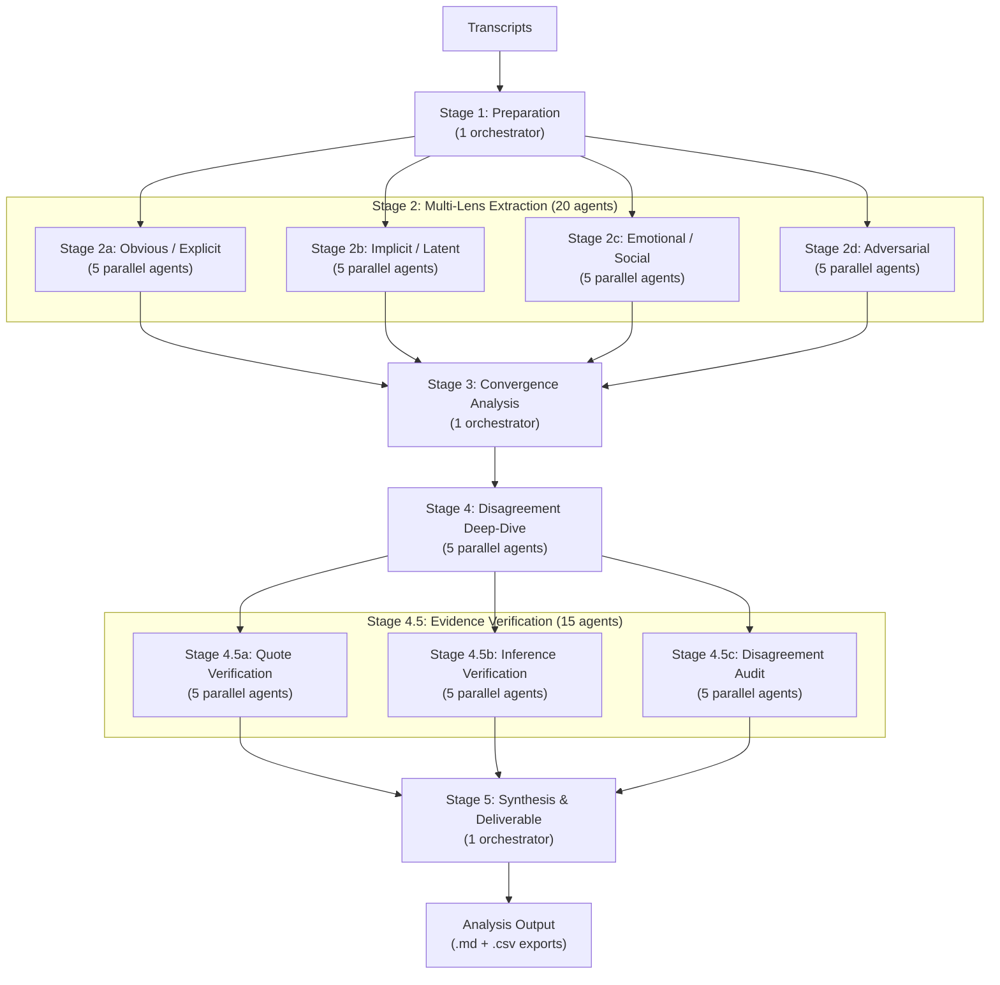

# Architecture Overview

This document explains how the KOOS research analysis system works -- what it is, how its pieces fit together, and why it is built this way.

---

## 1. System Overview

This repository is a methodology framework. It turns Claude Desktop into a standardized research analyst that follows KOOS's established methods, uses KOOS's terminology, and produces deliverables that match KOOS's quality standards.

**How it works in practice:**

1. Connect this repository as a project in Claude Desktop.
2. Navigate to a project folder (e.g., `projects/amsterdam-municipality/1-discover/`).
3. Type a slash command like `/analyze-jtbd`.
4. Claude reads the transcripts, runs a 43-agent analysis pipeline, and produces a structured deliverable with evidence-backed findings.

That is it. No code to run, no tools to install.

### CLAUDE.md Layering

The system uses layered context files to shape Claude's behavior at each level:

- **Root level** (`CLAUDE.md` at the repo root) -- Defines the analyst's identity, capabilities, quality guardrails, and output standards. Applies to every analysis.
- **Project level** (e.g., `projects/amsterdam-municipality/CLAUDE.md`) -- Provides client context: who the client is, what the engagement is about, key stakeholders, and project goals.
- **Phase level** (e.g., `projects/amsterdam-municipality/1-discover/CLAUDE.md`) -- Calibrates the analytical stance based on the Double Diamond phase. A Discover analysis casts a wide net. A Define analysis converges. The phase file sets that tone.

Each layer adds specificity without overriding the layers above. Root sets the rules. Project sets the context. Phase sets the analytical posture.

### Slash Commands

Four analysis types are available as slash commands:

| Command | What It Does |
|---|---|
| `/analyze-jtbd` | Jobs to Be Done analysis -- identifies what people are trying to accomplish |
| `/analyze-pains-gains` | Pains and Gains analysis -- maps frustrations and desired outcomes |
| `/analyze-personas` | Needs-Based Persona Synthesis -- clusters participants by shared needs |
| `/analyze-journey` | Customer Journey Mapping -- traces the end-to-end experience |

### Path-Scoped Rules

Sector-specific sensitivities load automatically based on the project folder. Inside `projects/vgz-healthcare/`, healthcare rules activate (patient privacy, emotional weight, caretaker perspectives). Inside `projects/ns-railways/`, mobility rules activate (safety prioritization, disruption sensitivity). Inside `projects/amsterdam-municipality/`, public sector rules activate (inclusivity, digital divide awareness, democratic accountability).

No one needs to remember to apply these. They activate based on the file path.

---

## 2. Analysis Pipeline

Every analysis -- regardless of type -- follows the same multi-agent pipeline. Here is the full flow:

**Total: 43 agent runs per analysis.** Three orchestrators (Stages 1, 3, and 5) manage the pipeline. Twenty extraction agents apply four analytical lenses in parallel. Five agents resolve disagreements. Fifteen verification agents audit the evidence. The result is a structured deliverable with confidence scores, evidence trails, and a verification report.

---

## 3. Why Multi-Agent

A single analyst reads transcripts once and anchors on whatever stands out first. That is how cognition works, but it means a single pass will always be shaped by what was vivid, what came first, and what fits existing expectations.

Twenty independent extraction runs address this. Each agent reads the same transcripts through a different lens:

- **Obvious / Explicit** -- What did participants directly say? What needs did they name out loud?
- **Implicit / Latent** -- What did participants reveal without realizing it? What needs are visible in their behavior but not in their words?
- **Emotional / Social** -- What emotions surfaced? What social dynamics shaped their experience? What was the feeling beneath the function?
- **Adversarial** -- What is the uncomfortable finding? What did the other lenses miss because it contradicts the expected narrative?

Five agents run each lens independently. They do not see each other's work. When the orchestrator merges their outputs in Stage 3, it can measure convergence: if 16 out of 20 agents identified the same job-to-be-done, that is a strong signal backed by independent agreement. If only 3 found it, it is a weak signal that needs human review.

The adversarial lens deserves special attention. It catches what confirmation bias would hide -- findings that contradict assumptions, pain points that challenge the proposed solution, needs that do not fit the project narrative. A single analyst might soften these. Five adversarial agents running independently make them hard to ignore.

---

## 4. Evidence Verification

LLMs can hallucinate quotes -- producing text that sounds like something a participant said but does not appear in the transcripts. The verification layer (Stage 4.5) catches this before any deliverable reaches a client. Three checks run in parallel:

- **Quote Verification (4.5a)** -- Every quoted statement is traced back to its source transcript. Does the quote exist? Is it accurately reproduced? Is it attributed to the correct participant?
- **Inference Verification (4.5b)** -- Every conclusion is checked against its supporting evidence. A participant saying "I called three times" supports "difficulty reaching the service" but does not support "the phone system is broken." This catches overreach.
- **Disagreement Audit (4.5c)** -- When agents disagree, this stage verifies the disagreement is based on real, properly contextualized evidence rather than misinterpretation.

Every deliverable includes a verification report: quote accuracy rates, inference validation outcomes, and audit results. The system is trustworthy not because AI is infallible, but because it checks its own work systematically.

---

## 5. Double Diamond Integration

KOOS works in the Double Diamond: Discover, Define, Develop, Deliver. Each phase has a different analytical stance, and the phase-level `CLAUDE.md` files calibrate the analysis accordingly:

- **Discover** -- Divergent. Cast a wide net. Include rather than exclude. Do not filter for feasibility. Capture everything, especially the unexpected. The most valuable insights are often the surprises.
- **Define** -- Convergent. Synthesize patterns into problem statements, personas, and opportunity areas. Prioritize and focus. Turn breadth into clarity.
- **Develop** -- Divergent. Evaluate solution concepts against the needs, pains, and jobs identified earlier. Look for mismatches between what is being built and what people actually need.
- **Deliver** -- Convergent. Validate what works and what does not. Measure against the evidence base built in earlier phases. Be precise and evaluative.

The same slash commands work in every phase. The analysis pipeline is identical. What changes is the analytical posture -- how broadly to search, how strictly to filter, and what kind of output the deliverable emphasizes.

---

## 6. Protocol Dependency Rule

The four analysis types have a dependency structure:

- **JTBD** and **Pains & Gains** are fully independent. Run them in any order. Run one or both. Neither requires the other.
- **Persona Synthesis** checks the `analysis/` folder for existing JTBD and Pains & Gains outputs. If they exist, they become mandatory input -- the persona analysis builds on them. If they do not exist, the persona analysis extracts needs directly from transcripts.
- **Journey Mapping** follows the same rule but checks for all prior analyses: JTBD, Pains & Gains, and Personas. Whatever exists gets used.

The rule is simple: **use it if it is there (non-negotiable), work without it if it is not.** Analyses build on each other when possible, but nothing is blocked by the absence of a prerequisite.

---

## 7. Extensibility

The system is designed to grow with KOOS's practice. Every component is modular:

**Add a new analysis protocol.** Create four files: a protocol in `protocols/` (the pipeline instructions), a methodology doc in `methodologies/` (the theoretical foundation), an output template in `templates/output-formats/` (the deliverable structure), and a slash command in `.claude/commands/` (the user-facing trigger). The existing protocols serve as patterns to follow.

**Add a new project.** Create a project folder under `projects/` with a `CLAUDE.md` (client context), a `context/` folder (briefs, desk research, stakeholder notes), and phase subfolders with their own `CLAUDE.md` files, scoping documents, and transcript folders. The three existing projects -- Amsterdam Municipality, NS Railways, and VGZ Healthcare -- are templates.

**Add new sector rules.** Create a rule file in `.claude/rules/` with a `paths` frontmatter block pointing to the relevant project folder. The rule activates automatically whenever Claude works within that path. The existing rules for healthcare, mobility, and public sector show the pattern.

**Customize the methodology.** The knowledge base (`knowledge-base/`) contains KOOS's identity, tone of voice, glossary, deliverable standards, and ethics guidelines. Editing these files changes how every analysis behaves -- the glossary terms Claude uses, the ethical checks it applies, the tone it writes in, the quality bar it enforces.

No engineering is required for any of these changes. The system is configured entirely through markdown files.
