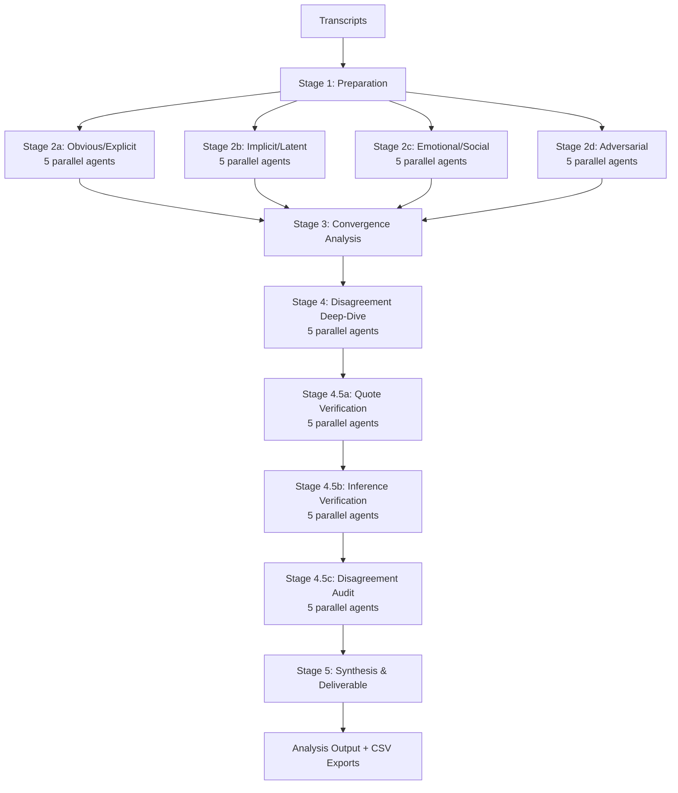

# Koos AI-Augmented Research Analysis Framework — Implementation Plan

> **For agentic workers:** REQUIRED SUB-SKILL: Use superpowers:subagent-driven-development (recommended) or superpowers:executing-plans to implement this plan task-by-task. Steps use checkbox (`- [ ]`) syntax for tracking.

**Goal:** Build a demo git repo that encodes Koos design agency's research methodologies as AI-executable protocols, complete with synthetic interview transcripts and example analysis output, ready for a walkthrough with the CEO and senior designers.

**Architecture:** Pure markdown repo. CLAUDE.md files at root, project, and phase level instruct Claude Desktop. Knowledge base docs provide context; protocol docs define multi-agent analysis pipelines (4 lenses x 5 agents + evidence verification = 43 agent runs per analysis). Three demo projects with 10 Dutch interview transcripts each showcase different Double Diamond phases.

**Tech Stack:** Markdown, CLAUDE.md (Claude Desktop), git. No code, no dependencies.

**Spec:** `docs/superpowers/specs/2026-04-11-koos-research-framework-design.md`

---

## Parallelization Map

Tasks 1-4 are independent — can all run in parallel.
Task 5 depends on Tasks 1-4 (protocols reference knowledge base, methodologies, and templates).
Task 6 depends on Task 5 (root CLAUDE.md references protocols).
Tasks 7, 8, 9 are independent of each other — can run in parallel. They depend on Task 6 (project CLAUDE.md files reference root patterns).
Tasks 10, 11, 12 are independent of each other — can run in parallel. Each depends on its project structure task (7, 8, 9 respectively).
Task 13 depends on Task 11 (example output references VGZ transcripts) and Task 5 (uses protocol output format).
Tasks 14 and 15 depend on everything above (they describe the whole system).

```
Tasks 1-4 (parallel)
    └─► Task 5
         └─► Task 6
              └─► Tasks 7, 8, 9 (parallel)
                   └─► Tasks 10, 11, 12 (parallel)
                        └─► Task 13
                             └─► Tasks 14, 15 (parallel)
```

---

### Task 1: Knowledge Base — Company & Ethics

**Files:**
- Create: `knowledge-base/company/about-koos.md`
- Create: `knowledge-base/company/sectors.md`
- Create: `knowledge-base/ethics/research-ethics.md`
- Create: `knowledge-base/ethics/anonymization.md`
- Create: `knowledge-base/glossary.md`

- [ ] **Step 1: Create directory structure**

```bash
mkdir -p knowledge-base/company knowledge-base/ethics
```

- [ ] **Step 2: Write `knowledge-base/company/about-koos.md`**

Write the full Koos company profile. Content must include:
- Company identity: Koos B.V., ~40 people, B Corp certified, founded ~2010
- Offices: Amsterdam (Danzigerbocht 39, 1013 AM) and Abu Dhabi (Incubator Building, Masdar City)
- Mission: "Your catalyst for change" — designing for people, accelerated by tech, delivering for business
- Three pillars: Service Design, UX/UI Design, Human-Centered AI
- 15-year track record of bridging strategy and execution
- Key client stats: Careem (50M users), NS (10.1M passengers), CoronaCheck (16M+ downloads, 250M+ certificates), VGZ (13% NPS increase), Rijkswaterstaat (permit time 26→8 weeks), Amsterdam Municipality (teacher shortage 18.7%→12.2%)
- Major client list: Careem, Siemens, Volkswagen, NS, Philips, OLX, ING, Amsterdam Municipality, Vodafone Ziggo, KLM, Randstad, VGZ, Tommy Hilfiger, Rijkswaterstaat
- Position as trusted independent partner
- Tone: factual, not promotional. This orients Claude on who it's working for.

Target length: ~400-600 words.

- [ ] **Step 3: Write `knowledge-base/company/sectors.md`**

Write the six-sector breakdown. For each sector, include:
- Sector name and description
- Typical problems Koos solves in this sector
- Key stakeholders (who commissions, who benefits, who is affected)
- Domain sensitivities Claude must be aware of

The six sectors:

1. **Public Sector**: Policy and service development for national/local governments. Stakeholders: citizens, civil servants, policymakers. Sensitivities: inclusivity, accessibility, democratic accountability, vulnerable populations, privacy. Example work: Amsterdam Municipality, Rijkswaterstaat, CoronaCheck, Dutch Police.

2. **Big Tech**: Super apps and platform experiences. Stakeholders: product teams, end users at massive scale, business units. Sensitivities: scale (50M+ users), cultural diversity across markets, balancing business metrics with user needs. Example work: Careem, OLX.

3. **Healthcare**: Hospital, insurance, and health product innovation. Stakeholders: patients, healthcare professionals, insurers, regulators. Sensitivities: patient privacy (medical data), vulnerable populations (chronic illness, mental health), regulatory compliance, medical accuracy, emotional weight of health decisions. Example work: VGZ, Santeon, CUF, Eurocross.

4. **Mobility**: Public transport, aviation, leasing. Stakeholders: passengers, operators, transport authorities. Sensitivities: safety, accessibility, real-time reliability, multi-modal complexity. Example work: NS Dutch Railways, Dubai Airports, KLM.

5. **Finance**: Banking and financial services. Stakeholders: customers, compliance teams, product teams. Sensitivities: financial privacy, regulatory constraints, trust, financial vulnerability (debt, payment difficulties). Example work: ING, bunq, KPN (payment difficulties).

6. **Energy**: Energy transition and sustainability. Stakeholders: consumers, grid operators, policymakers. Sensitivities: sustainability commitments, technical complexity (smart meters, grid), consumer behavior change. Example work: Liander.

Target length: ~600-800 words.

- [ ] **Step 4: Write `knowledge-base/ethics/research-ethics.md`**

Write the research ethics guidelines. Content:

- **Respect for participants**: They gave their time and trust. Their words are not raw material to be mined — they're contributions to be honored.
- **Contextual integrity**: Never take quotes out of context to support a predetermined conclusion. If a quote supports point A but the surrounding conversation contradicts it, report both.
- **Honest representation**: Distinguish clearly between what participants said (direct evidence) and what we interpret from what they said (inference). Label each.
- **Sample awareness**: Always flag when sample size is too small to generalize. 10 interviews can reveal patterns — they cannot prove prevalence. Use language like "participants in this study" not "users" or "customers" broadly.
- **Sensitive topics**: Extra care when findings touch health conditions, financial struggles, personal relationships, discrimination experiences, or mental health. Frame with empathy, never clinical detachment.
- **Participant agency**: Participants may have said things they'd retract on reflection. Don't weaponize throwaway comments as primary evidence. Weight matters — distinguish between considered responses and offhand remarks.
- **Disconfirming evidence**: Actively seek and report evidence that contradicts the emerging narrative. A finding that ignores contradictions is not an insight — it's advocacy.
- **Power dynamics**: Be aware that interview dynamics (expert interviewer vs. participant) may have shaped responses. Flag questions that may have been leading.

Target length: ~500-700 words.

- [ ] **Step 5: Write `knowledge-base/ethics/anonymization.md`**

Write anonymization guidelines. Content:

- **Participant identification**: Always use participant IDs (P01, P02, ...). Never use real names, even in internal documents.
- **Direct identifiers**: Remove all names (participants, family members, friends, colleagues, doctors, case workers mentioned by name).
- **Indirect identifiers**: Remove or generalize: specific employers ("I work at [company]" → "I work at [a large employer in the area]"), specific neighborhoods (use general area), schools, hospitals/clinics by name, specific dates of events.
- **Medical information**: In healthcare projects, generalize specific diagnoses when the diagnosis itself isn't the research topic. "I have [a chronic condition]" vs. exact diagnosis, unless the research is specifically about that condition.
- **Financial details**: Remove specific amounts, account numbers, policy numbers. Generalize to ranges if relevant.
- **Quote handling**: When a quote contains identifying information, paraphrase that specific portion and mark it with [anonymized]. Keep the rest verbatim. Example: Original: "My doctor at the OLVG told me..." → Anonymized: "My doctor at [anonymized: hospital] told me..."
- **Small sample risk**: With only 10 participants, combinations of characteristics (age + neighborhood + condition) may identify someone even without names. Review the full set of quotes attributed to each participant ID to ensure the aggregate doesn't create a identifiable profile.
- **Context across quotes**: Two innocuous quotes from the same participant may become identifying when read together. Review per-participant quote collections holistically.

Target length: ~400-500 words.

- [ ] **Step 6: Write `knowledge-base/glossary.md`**

Write the Koos terminology glossary. For each term: definition, example of correct usage, common misuse to avoid. Terms to include:

1. **Insight**: A non-obvious finding, supported by evidence from multiple participants, that changes how we understand the problem or opportunity. Not just a fact. Example: "Parents don't read the full letter — they scan for the date and the amount" is an insight. "Parents receive letters" is not.
2. **Observation**: Something noticed in the data that may or may not be significant. An observation becomes a finding when it recurs; it becomes an insight when it's non-obvious and actionable. Misuse: using "observation" and "insight" interchangeably.
3. **Finding**: A pattern or conclusion supported by evidence across multiple participants. Stronger than an observation (has evidence), but may not be non-obvious enough to be an insight. All insights are findings; not all findings are insights.
4. **Need**: Something a person requires to achieve their goal — can be functional (I need to submit this form), emotional (I need to feel confident), or social (I need to not look foolish in front of my family). Misuse: confusing needs with solutions ("I need a better website" is a solution preference, not a need).
5. **Pain point**: A specific friction, frustration, or obstacle in the current experience. Must be tied to a specific moment or touchpoint. Misuse: using "pain point" for broad dissatisfaction ("the service is bad" is not a pain point; "I had to call three times before anyone answered" is).
6. **Gain**: A desired outcome or benefit the person is seeking — can be required (must happen), expected (should happen), desired (would be nice), or unexpected (delightful surprise). Based on Osterwalder's Value Proposition Canvas.
7. **Job to be done (JTBD)**: The underlying progress a person is trying to make in a given circumstance. Expressed as: "When [situation], I want to [motivation], so I can [expected outcome]." Three types: functional (get something done), emotional (feel a certain way), social (be perceived in a certain way). Misuse: confusing jobs with tasks or features.
8. **Moment of truth**: A touchpoint where the experience either earns or breaks trust. These are the make-or-break interactions that disproportionately shape overall perception. Not every touchpoint is a moment of truth — only the high-stakes ones.
9. **Touchpoint**: Any point of interaction between the person and the service/organization. Can be digital (website, app), physical (office, store), or human (phone call, face-to-face). Moments of truth are a subset of touchpoints.
10. **Persona**: A representative archetype built from research data. At Koos, personas are needs-based (clustered by need patterns), not demographic (not "Sarah, 34, marketing manager"). Each persona represents a distinct need pattern that may span ages, genders, and backgrounds.
11. **Journey map**: A visualization of the complete experience across touchpoints, showing actions, emotions, pain points, and opportunities over time. Must be evidence-based — every element tied to transcript data.
12. **Service blueprint**: An extension of the journey map that also shows the organizational processes behind the scenes — frontstage (what the customer sees) and backstage (what happens internally). Not the same as a journey map.
13. **Convergence**: In multi-agent analysis, the degree to which independent analysis runs agree on a finding. High convergence = strong signal. Low convergence = needs human review.
14. **Evidence trail**: The chain connecting a finding back to its source data — which transcript, which quote, which participant, which analysis pass identified it. Every finding must have one.
15. **Confidence level**: A rating assigned to each finding based on convergence across analysis runs. High (12+/20 runs), Medium (6-11), Low (1-5). Not a statement about truth — a statement about how consistently the finding emerged across independent analyses.
16. **Double Diamond**: The design process framework: Discover (diverge to explore the problem) → Define (converge to frame the problem) → Develop (diverge to generate solutions) → Deliver (converge to validate and refine). Each phase requires different analytical behavior.

Target length: ~800-1000 words.

- [ ] **Step 7: Commit knowledge base files**

```bash
git add knowledge-base/
git commit -m "Add knowledge base: company profile, sectors, ethics, glossary"
```

---

### Task 2: Knowledge Base — Brand

**Files:**
- Create: `knowledge-base/brand/tone-of-voice.md`
- Create: `knowledge-base/brand/deliverable-standards.md`

- [ ] **Step 1: Create directory structure**

```bash
mkdir -p knowledge-base/brand
```

- [ ] **Step 2: Write `knowledge-base/brand/tone-of-voice.md`**

Write the Koos tone of voice guide. Content must include:

**Core principles:**
- Professional but warm — not corporate, not casual
- Evidence-driven — never speculative without explicitly flagging it as interpretation
- Clear and visual — prefer structured layouts, tables, and concrete examples over walls of text
- Empathetic toward research participants — they are people who shared their experiences, not "data points" or "users"
- Dutch directness — concise, no fluff, no hedging, but never cold or dismissive
- Confident but honest — state what the evidence shows clearly, acknowledge what it doesn't

**Before/after examples (4 pairs):**

1. Writing about participants:
   - Don't: "Users expressed frustration with the onboarding flow."
   - Do: "Seven out of ten participants described frustration during onboarding — particularly at the identity verification step, where three abandoned the process entirely."

2. Presenting uncertain findings:
   - Don't: "The data suggests that younger users prefer mobile interfaces."
   - Do: "Three of the four participants under 30 preferred the mobile app over the website. However, with only four participants in this age group, this pattern needs validation with a larger sample."

3. Describing pain points:
   - Don't: "There are issues with the communication strategy."
   - Do: "Participants consistently reported receiving conflicting information from different channels — P03 was told one thing by phone and another by letter, P07 received outdated information via email that contradicted the website."

4. Making recommendations:
   - Don't: "The company should consider improving the digital experience to drive customer satisfaction."
   - Do: "The three highest-impact opportunities based on evidence strength and frequency: (1) Consolidate medication switch communication into a single, clear notification — cited by 8/10 participants. (2) Add real-time status tracking for claims — the most common workaround was calling the helpdesk to ask 'where is my claim?' (3) Simplify the referral letter process — currently requires 3 steps that could be reduced to 1."

**Language preferences:**
- "Participants" not "users" or "respondents" (unless the research method is a survey)
- "Evidence suggests" not "data shows" (we're dealing with qualitative research, not statistics)
- "We observed" not "it was observed" (active voice, own the analysis)
- Use participant IDs when citing: "P03 described..." not "one participant described..."
- Dutch-language deliverables follow the same principles

Target length: ~600-800 words.

- [ ] **Step 3: Write `knowledge-base/brand/deliverable-standards.md`**

Write the deliverable standards guide. Content:

**Structure of every deliverable:**
1. **Executive summary** (max 200 words): What did we find? 3-5 key takeaways. Written so a stakeholder who reads nothing else gets the essential picture.
2. **Research context** (brief): Who was researched, when, why, what method, what phase of the project.
3. **Findings** (main body): Organized by theme, confidence level, or analysis type. Each finding has: statement, confidence level, supporting evidence with quotes and participant IDs, and implications.
4. **Evidence index**: A reference section where every finding can be traced back to specific transcript passages and (in multi-agent analysis) which agent runs identified it.
5. **Methodology note**: Brief description of how the analysis was conducted — which protocol, how many passes, what verification was done.
6. **Recommended next steps**: What should happen based on these findings? Distinguish between "the evidence strongly supports" and "we recommend exploring."

**Formatting standards:**
- Use headings (H2, H3) to create scannable hierarchy
- Use tables for comparative data (e.g., confidence matrices, prioritization grids)
- Use blockquotes (>) for participant quotes — always with participant ID
- Use callout formatting for important notes, caveats, and human-review flags
- Bold key terms on first use
- Keep paragraphs short (3-5 sentences max)
- Number findings for easy reference (e.g., JOB-001, PAIN-003, PERSONA-A)

**Quality bar:**
- No finding without evidence (minimum 2 supporting quotes from different participants)
- No evidence without a source (every quote has a participant ID and transcript reference)
- No recommendation without a finding (recommendations trace back to specific findings)
- Confidence levels on everything — never present uncertain conclusions as facts
- Export-ready formats (CSV) alongside every markdown deliverable

Target length: ~500-700 words.

- [ ] **Step 4: Commit brand docs**

```bash
git add knowledge-base/brand/
git commit -m "Add brand guidelines: tone of voice and deliverable standards"
```

---

### Task 3: Methodology Documents

**Files:**
- Create: `methodologies/jobs-to-be-done.md`
- Create: `methodologies/pains-and-gains.md`
- Create: `methodologies/needs-based-personas.md`
- Create: `methodologies/customer-journey-mapping.md`

- [ ] **Step 1: Create directory**

```bash
mkdir -p methodologies
```

- [ ] **Step 2: Write `methodologies/jobs-to-be-done.md`**

Write the Koos JTBD methodology reference. This is framework documentation, not a protocol (execution instructions go in `protocols/`). Content:

**What is a Job to Be Done:**
- Based on Clayton Christensen's JTBD theory
- A JTBD is the underlying progress a person is trying to make in a given circumstance
- People don't "want" products or services — they "hire" them to get a job done
- The job exists independent of any solution — it's about the person's goal, not the product

**Three types of jobs:**
- **Functional**: The practical task — what needs to get done. "When I receive a new medication, I want to understand the dosage instructions, so I can take it correctly."
- **Emotional**: How the person wants to feel (or not feel). "When I switch health insurers, I want to feel confident I'm making the right choice, so I can stop worrying about coverage gaps."
- **Social**: How the person wants to be perceived by others. "When managing my elderly parent's insurance, I want to appear competent to my siblings, so they trust me with this responsibility."

**The Koos format:**
"When [situation/trigger], I want to [motivation/desired progress], so I can [expected outcome/benefit]."
- The situation is critical — the same person may have different jobs in different circumstances
- The motivation describes the progress, not a feature request
- The outcome is the ultimate benefit — often emotional or social even for functional jobs

**When to use JTBD analysis:**
- Exploratory research (Discover phase): Understanding what people are trying to accomplish
- Concept testing (Develop phase): Evaluating whether a concept addresses the right jobs
- Evaluative research (Deliver phase): Assessing whether a solution actually enables the jobs
- Any time you need to reframe from "what's wrong" to "what are people trying to achieve"

**Koos-specific principles:**
- Every job must be backed by transcript evidence — no hypothetical jobs
- Always consider the situation/context — the same person has different jobs in different moments
- Jobs exist in a hierarchy — big jobs contain smaller jobs. Report at the level that's actionable.
- Distinguish between the "main job" and "related jobs" — the main job is what they hired the service for; related jobs are adjacent needs the service could also address
- Surface conflicting jobs — people often have jobs that tension against each other (e.g., "I want quick service" vs. "I want to feel heard and understood")

**Common pitfalls:**
- Confusing jobs with tasks ("fill in the form" is a task, not a job)
- Confusing jobs with solutions ("I need a mobile app" is a solution, not a job)
- Writing jobs that are too vague ("I want a better experience")
- Ignoring the situation context — jobs without situations are generic and unhelpful
- Only finding functional jobs — emotional and social jobs often have more design implications

Target length: ~800-1000 words.

- [ ] **Step 3: Write `methodologies/pains-and-gains.md`**

Write the Koos pains & gains methodology reference. Content:

**Framework origin:** Based on Alex Osterwalder's Value Proposition Canvas, adapted for qualitative research analysis at Koos.

**Pains — three categories:**
- **Functional pains**: Things that don't work, waste time, create effort. Process friction, errors, delays, unnecessary steps. Example: "I have to call three times before anyone picks up."
- **Emotional pains**: Negative feelings triggered by the experience. Frustration, anxiety, confusion, feeling ignored, embarrassment, overwhelm. Example: "Every time I open that letter, my heart sinks because I don't understand what they want from me."
- **Social pains**: Negative social consequences. Looking incompetent, being judged, losing status, burdening others. Example: "I have to ask my daughter to help me with the website, and I feel like a burden."

**Gains — four levels (Osterwalder):**
- **Required gains**: The basic expectation — if this isn't met, the service fails entirely. "I need to actually receive the medication I was prescribed."
- **Expected gains**: What people assume will happen. "I expect to be notified when my claim is processed."
- **Desired gains**: Things people would love but don't expect. "I'd love it if they could tell me how long the wait will be."
- **Unexpected gains**: Delights — things people didn't even know they wanted. "I didn't expect the pharmacist to call me proactively about the switch."

**When to use:**
- Concept testing (Develop): Which pains does the concept address? Which gains does it enable? What pains does it create?
- Evaluative research (Deliver): Is the solution actually relieving the target pains? Are new pains emerging?
- Value proposition design: Mapping pains and gains to solution features
- Complementary to JTBD — jobs tell you what people are trying to do; pains and gains tell you what makes it hard or rewarding

**Koos-specific principles:**
- Always link pains and gains to specific touchpoints or moments in the journey — not free-floating
- Pains and gains are always evidenced — direct quotes showing the pain or gain being experienced
- Severity matters — a pain mentioned once in passing is different from one that dominates the interview
- Look for pains people have normalized — "I always have to..." often hides a pain the participant no longer recognizes as abnormal
- Gains can reveal unmet pains — when someone describes a desired gain, the absence of it is often an unspoken pain

Target length: ~700-900 words.

- [ ] **Step 4: Write `methodologies/needs-based-personas.md`**

Write the Koos persona methodology. Content:

**Why needs-based, not demographic:**
- Traditional personas (Sarah, 34, marketing manager, lives in Amsterdam) cluster by demographics
- Koos builds personas by clustering need patterns — who wants the same things, regardless of age, gender, or occupation
- Two 35-year-old women can have completely different needs; a 25-year-old student and a 60-year-old retiree can share the same need pattern
- Needs-based personas are more actionable for design — they tell you what to design for, not who to design for

**How Koos builds personas:**
1. Start with JTBD and pains/gains analysis (when available — if not, extract directly from transcripts)
2. Cluster participants by shared need patterns: similar jobs, similar pains, similar behaviors, similar barriers
3. Identify the distinguishing characteristics: what makes this cluster different from the others?
4. Name the archetype — a descriptive name that captures the essence ("The Reluctant Digital Adopter," "The Proactive Self-Manager")
5. Build the persona card with: archetype name, need pattern description, key jobs, top pains, top gains, representative quotes, behavioral indicators

**Persona card structure:**
- Archetype name (descriptive, not a proper name)
- One-sentence description of this person's fundamental orientation
- Key jobs to be done (3-5)
- Primary pains (3-5)
- Primary gains (3-5)
- Representative quotes (2-3 verbatim quotes that capture this persona's voice)
- Behavioral indicators (how do you recognize this persona in the wild?)
- Participants who belong to this cluster (by ID)

**Koos-specific principles:**
- 3-5 personas per project is the sweet spot — fewer than 3 means you're not seeing the diversity; more than 5 means you're overfitting
- Personas must be evidence-based — every attribute traced to transcript data
- Avoid stereotypes — if a persona starts looking like a caricature, revisit the clustering
- Personas are tools for design decisions, not customer segments for marketing
- Every participant should fit into a persona — if someone doesn't fit, your clustering needs work or you need another persona
- Acknowledge overlap — some participants may have characteristics of multiple personas. Note this rather than forcing a single classification.

Target length: ~700-900 words.

- [ ] **Step 5: Write `methodologies/customer-journey-mapping.md`**

Write the Koos journey mapping methodology. Content:

**What a journey map captures:**
- The full experience across time — from first awareness through completion (and beyond)
- Touchpoints: every point of interaction (digital, physical, human)
- Actions: what the person does at each touchpoint
- Emotional arc: how the person feels at each stage (satisfaction, frustration, anxiety, relief, delight)
- Pain points: where friction occurs
- Moments of truth: the high-stakes interactions that disproportionately shape the overall experience
- Opportunities: where design intervention would have the most impact

**Journey map structure at Koos:**
- **Phases/stages**: The major stages of the experience (e.g., Awareness → Research → Decision → Onboarding → Usage → Support)
- **Touchpoints per stage**: Each interaction point within a stage
- **Actions**: What the person does (verb-driven: "calls helpdesk," "opens letter," "searches website")
- **Thoughts**: What the person is thinking (from transcript evidence)
- **Emotions**: How the person feels (rated: very negative, negative, neutral, positive, very positive)
- **Pain points**: Specific frictions at this touchpoint
- **Moments of truth**: Marked distinctly — these are the make-or-break moments
- **Opportunities**: Design interventions that could improve this touchpoint

**When to use:**
- After JTBD and pains/gains (when available) — the journey map ties individual findings to the temporal flow
- Define phase: synthesizing Discover findings into a visual narrative
- Develop phase: mapping how a concept changes the current journey
- Deliver phase: comparing intended journey vs. actual experience

**Koos-specific principles:**
- Evidence-based: every touchpoint, emotion, and pain point backed by transcript data
- Multi-stakeholder awareness: the customer's journey intersects with internal organizational processes — note where these affect the experience
- Moments of truth are focal points — design energy should concentrate here
- The journey doesn't start when the person contacts the organization — it starts when the need arises
- Include the "before" and "after" — what happens before the first touchpoint and after the last one
- Map what actually happens, not what's supposed to happen — the gap between designed process and lived experience is where insights live

Target length: ~700-900 words.

- [ ] **Step 6: Commit methodology docs**

```bash
git add methodologies/
git commit -m "Add methodology references: JTBD, pains/gains, personas, journey mapping"
```

---

### Task 4: Output Templates

**Files:**
- Create: `templates/project-scoping.md`
- Create: `templates/output-formats/jtbd-output.md`
- Create: `templates/output-formats/pains-gains-output.md`
- Create: `templates/output-formats/persona-card.md`
- Create: `templates/output-formats/journey-map-output.md`

- [ ] **Step 1: Create directory structure**

```bash
mkdir -p templates/output-formats
```

- [ ] **Step 2: Write `templates/project-scoping.md`**

Write the project scoping intake template. This is a fill-in template that gets copied into each project phase before analysis begins. Content:

```markdown
# Project Scoping — [Project Name]

## Project Information

- **Client:** [Client name]
- **Project:** [Project/engagement name]
- **Phase:** [Discover / Define / Develop / Deliver]
- **Research type:** [Exploratory / Concept testing / Evaluative / Other: specify]
- **Date(s) of research:** [When were interviews conducted]
- **Analysis date:** [Today's date]
- **Analyst:** [Who is running this analysis]

## Research Questions

What are we trying to learn? List 3-5 specific questions this research should answer.

1. [Question 1]
2. [Question 2]
3. [Question 3]

## Hypotheses (if applicable)

What do we expect to find? These are assumptions to be validated or invalidated.
Leave blank for purely exploratory research.

1. [Hypothesis 1]
2. [Hypothesis 2]

## Target Audience

Who was interviewed and why?

- **Total participants:** [N]
- **Recruitment criteria:** [How were participants selected?]
- **Composition:** [Brief breakdown — e.g., "5 daily commuters, 3 occasional travelers, 2 tourists"]
- **Known gaps:** [Who is NOT represented in this sample?]

## Interview Guide Summary

What topics were covered in the interviews?

- [Topic 1]
- [Topic 2]
- [Topic 3]

## Known Constraints or Biases

What should the analyst be aware of before starting?

- [e.g., "All participants were recruited through the client's existing customer base — non-customers are not represented"]
- [e.g., "Interviews were conducted in Dutch — nuances may exist for non-native speakers"]
- [e.g., "The concept shown was a static mockup, not an interactive prototype — reactions may differ with a working version"]

## Requested Analyses

Which analysis protocols should be run?

- [ ] Jobs to Be Done (JTBD)
- [ ] Pains & Gains
- [ ] Needs-Based Personas
- [ ] Customer Journey Mapping

## Additional Context

Any other information the analyst should know before starting?

[Free text]
```

- [ ] **Step 3: Write `templates/output-formats/jtbd-output.md`**

Write the JTBD output template. This defines the exact structure of a JTBD analysis deliverable:

```markdown
# Jobs to Be Done Analysis — [Project Name]

## Executive Summary

[Max 200 words. Key findings: how many jobs identified, top 3-5 highest-confidence jobs, any notable tensions or surprises. Written for a stakeholder who reads nothing else.]

## Research Context

- **Client:** [Client]
- **Phase:** [Double Diamond phase]
- **Research type:** [Type]
- **Participants:** [N] participants — [brief composition]
- **Analysis protocol:** Multi-agent JTBD extraction (4 lenses × 5 agents = 20 independent runs)
- **Verification:** Quote verification, inference verification, disagreement audit (5 agents each)

## Findings

### High Confidence Jobs (12+ of 20 runs)

#### JOB-001: [When (situation), I want to (motivation), so I can (outcome)]

**Confidence:** [X]/20 runs
**Lenses:** obvious ([X]/5), implicit ([X]/5), emotional ([X]/5), adversarial ([X]/5)
**Type:** [Functional / Emotional / Social]

**Supporting evidence:**
> "Direct quote from transcript" — P[XX]
> Source: [lens]-agent-[N], [lens]-agent-[N]

> "Another supporting quote" — P[XX]
> Source: [lens]-agent-[N]

**Notes:** [Any adversarial notes, nuances, or caveats]

---

[Repeat for each high-confidence job]

### Medium Confidence Jobs (6-11 of 20 runs)

[Same format as above, with additional "Human Review Note" field explaining why confidence is medium and what would strengthen or weaken this finding]

### Low Confidence Jobs (1-5 of 20 runs)

[Same format, with "Review Recommendation" field: is this likely noise, a subtle insight, or an artifact of a specific lens?]

## Tensions & Conflicts

[Jobs that exist in tension with each other — where addressing one may compromise another. Include evidence for both sides.]

## Verification Report

- **Total quotes cited:** [N]
- **Verified exact:** [N] ([%])
- **Verified paraphrased (corrected):** [N] ([%])
- **Out of context (flagged):** [N] ([%])
- **Not found / removed:** [N] ([%])
- **Inferences well-supported:** [N]/[total] ([%])
- **Inferences plausible but thin:** [N]/[total] ([%])
- **Inferences unsupported / removed:** [N]/[total] ([%])

## Evidence Index

[Queryable reference: for each finding ID, list all supporting transcript passages with full context, participant IDs, and which agent runs identified them]

## Methodology Note

[Brief description of the multi-agent pipeline: how many agents, which lenses, what verification was performed]

## Recommended Next Steps

[What should happen based on these findings? Distinguish between "evidence strongly supports" and "recommend exploring further"]
```

- [ ] **Step 4: Write `templates/output-formats/pains-gains-output.md`**

Write the pains & gains output template. Same structural rigor as JTBD but organized by pain/gain type:

```markdown
# Pains & Gains Analysis — [Project Name]

## Executive Summary

[Max 200 words. Key findings: total pains/gains identified, top 3 highest-impact pains, top 3 highest-value gains, notable patterns.]

## Research Context

[Same fields as JTBD template]

## Pains

### High Confidence Pains (12+ of 20 runs)

#### PAIN-001: [Specific pain statement]

**Confidence:** [X]/20 runs
**Lenses:** functional ([X]/5), emotional ([X]/5), functional-gains ([X]/5), emotional-gains ([X]/5)
**Category:** [Functional / Emotional / Social]
**Severity:** [High / Medium / Low — based on how prominently it featured in interviews]
**Touchpoint:** [Where in the journey this pain occurs]

**Supporting evidence:**
> "Quote" — P[XX]
> Source: [lens]-agent-[N]

**Notes:** [Context, nuances]

---

[Repeat for each pain, organized by confidence tier]

## Gains

### High Confidence Gains (12+ of 20 runs)

#### GAIN-001: [Specific gain statement]

**Confidence:** [X]/20 runs
**Category:** [Required / Expected / Desired / Unexpected]
**Type:** [Functional / Emotional / Social]

[Same evidence structure as pains]

---

## Pain-Gain Connections

[Where specific pains and gains are two sides of the same coin — the absence of a gain is a pain, or resolving a pain creates a gain]

## Prioritization Matrix

| ID | Finding | Evidence Strength | Potential Impact | Frequency | Priority |
|----|---------|------------------|-----------------|-----------|----------|
| PAIN-001 | ... | High | High | High | Immediate |
| GAIN-003 | ... | Medium | High | Medium | Explore |

## Verification Report

[Same structure as JTBD template]

## Evidence Index

[Same structure as JTBD template]

## Methodology Note

[Brief pipeline description]

## Recommended Next Steps

[Prioritized actions]
```

- [ ] **Step 5: Write `templates/output-formats/persona-card.md`**

Write the persona card output template:

```markdown
# Needs-Based Personas — [Project Name]

## Executive Summary

[Max 200 words. How many personas identified, brief characterization of each, key differentiating factors between them.]

## Research Context

[Same fields as other templates, plus note on whether prior JTBD/pains-gains analyses were used as input]

## Personas

### PERSONA-A: [Archetype Name — e.g., "The Reluctant Digital Adopter"]

**Core orientation:** [One sentence capturing this persona's fundamental relationship to the service/context]

**Key jobs to be done:**
1. [Job statement] (evidence: P[XX], P[XX])
2. [Job statement] (evidence: P[XX], P[XX])
3. [Job statement] (evidence: P[XX])

**Primary pains:**
1. [Pain statement] (evidence: P[XX], P[XX])
2. [Pain statement] (evidence: P[XX], P[XX])
3. [Pain statement] (evidence: P[XX])

**Primary gains:**
1. [Gain statement] (evidence: P[XX], P[XX])
2. [Gain statement] (evidence: P[XX])
3. [Gain statement] (evidence: P[XX], P[XX])

**Representative quotes:**
> "Verbatim quote that captures this persona's voice" — P[XX]

> "Another representative quote" — P[XX]

**Behavioral indicators:** [How do you recognize this persona? What behaviors, language, or attitudes distinguish them?]

**Participants in this cluster:** P[XX], P[XX], P[XX]

**Confidence:** [X]/20 clustering runs identified this persona as a distinct cluster

---

[Repeat for each persona]

## Persona Overlaps

[Which participants showed characteristics of multiple personas? What does this overlap tell us?]

## Clustering Methodology

[How personas were derived: which prior analyses were used as input (or direct transcript analysis), the clustering lenses, adversarial challenge results]

## Verification Report

[Same structure]

## Recommended Next Steps

[How to use these personas in subsequent design work]
```

- [ ] **Step 6: Write `templates/output-formats/journey-map-output.md`**

Write the journey map output template:

```markdown
# Customer Journey Map — [Project Name]

## Executive Summary

[Max 200 words. The journey in brief: how many stages, key moments of truth, biggest pain points, biggest opportunities.]

## Research Context

[Same fields, plus note on which prior analyses were used as input]

## Journey Overview

| Stage | Key Touchpoints | Overall Emotion | Moments of Truth |
|-------|----------------|-----------------|-----------------|
| [Stage 1] | [Touchpoints] | [Emotion rating] | [Yes/No] |
| [Stage 2] | [Touchpoints] | [Emotion rating] | [Yes/No] |

## Detailed Journey

### Stage 1: [Stage Name — e.g., "Becoming Aware"]

**What happens:** [Brief narrative of this stage based on transcript evidence]

#### Touchpoint 1.1: [Touchpoint Name]

**Actions:** [What the person does]
**Thoughts:** [What the person is thinking — from transcript evidence]
**Emotion:** [Very Negative ← → Very Positive] — [specific emotion word: frustrated, anxious, relieved, etc.]
**Pain points:**
- [Pain] (evidence: P[XX]: "quote")
**Opportunities:**
- [Design opportunity based on the evidence]

**Evidence:**
> "Supporting quote" — P[XX]

[Mark as MOMENT OF TRUTH if applicable, with explanation of why this interaction is make-or-break]

---

[Repeat for all touchpoints across all stages]

## Moments of Truth Summary

[Dedicated section listing all moments of truth with cross-references to the detailed journey above]

## Emotional Arc Visualization

[Text-based representation of the emotional journey across stages — e.g., using a table with emoji or symbols showing the ups and downs]

## Gap Analysis

[Touchpoints that should exist but don't. Stages where participants described needing something that wasn't there.]

## Per-Persona Journey Variations

[If personas are available: how does the journey differ for Persona A vs. Persona B? Where do they diverge?]

## Verification Report

[Same structure]

## Recommended Next Steps

[Prioritized design interventions at key moments of truth and high-pain touchpoints]
```

- [ ] **Step 7: Commit templates**

```bash
git add templates/
git commit -m "Add output templates: project scoping, JTBD, pains/gains, personas, journey map"
```

---

### Task 5: Analysis Protocols

**Files:**
- Create: `protocols/README.md`
- Create: `protocols/jtbd-analysis.md`
- Create: `protocols/pains-gains-analysis.md`
- Create: `protocols/persona-synthesis.md`
- Create: `protocols/journey-mapping.md`
- Create: `protocols/quality-criteria.md`
- Create: `protocols/bias-and-rigor.md`
- Create: `protocols/prioritization.md`

This is the most critical task — these files are the "engine" that makes the system work. Each protocol must be a precise, step-by-step instruction set that Claude follows to execute the multi-agent analysis pipeline.

- [ ] **Step 1: Create directory**

```bash
mkdir -p protocols
```

- [ ] **Step 2: Write `protocols/README.md`**

Write the protocols overview document. Content:

- What protocols are: step-by-step execution instructions for AI-powered research analysis. Not methodology references (those are in `methodologies/`) — protocols are the operational playbook.
- The two execution modes:
  - **Autopilot**: Full pipeline runs without pausing. User gets the final deliverable.
  - **Guided** (default): Pipeline pauses after each major stage for human review and steering.
- The common pipeline architecture (table showing all stages, agent counts):
  - Stage 1: Preparation (1 orchestrator)
  - Stage 2a-d: Parallel Extraction — 4 lens stages × 5 agents = 20 runs
  - Stage 3: Convergence Analysis (1 orchestrator)
  - Stage 4: Disagreement Deep-Dive (5 parallel agents)
  - Stage 4.5a: Quote Verification (5 parallel agents)
  - Stage 4.5b: Inference Verification (5 parallel agents)
  - Stage 4.5c: Disagreement Audit (5 parallel agents)
  - Stage 5: Synthesis & Deliverable (1 orchestrator)
  - Total: 43 agent runs per analysis type
- The protocol dependency rule: use prior analysis outputs if they exist (mandatory), work without them if they don't
- Confidence tier definitions: High (12+/20), Medium (6-11), Low (1-5)
- Reference to quality-criteria.md, bias-and-rigor.md, and prioritization.md as cross-cutting quality layers

Target length: ~500-700 words.

- [ ] **Step 3: Write `protocols/quality-criteria.md`**

Write the quality criteria document. Content:

**What makes a strong insight:**
- **Specific**: Describes a concrete behavior, need, or pain at a specific moment — not a vague generalization
- **Evidenced**: Supported by direct quotes from at least 2 different participants
- **Non-obvious**: Tells us something we didn't already know or assume — challenges or enriches existing understanding
- **Actionable**: Points toward a design response — if you can't imagine what you'd do differently based on this insight, it's not actionable enough

**What makes a weak insight (with examples for each analysis type):**

JTBD examples:
- Weak: "Users want a better experience" — too vague, not a job
- Strong: "When I receive a letter about a medication switch (situation), I want to understand why my medication is changing (motivation), so I can feel confident that the new medication will work for me (outcome)" — specific situation, clear motivation, emotional outcome

Pains & gains examples:
- Weak: "The website is confusing" — no specificity, no touchpoint
- Strong: "At the identity verification step, 6/10 participants couldn't find the upload button, leading 3 to abandon the process entirely" — specific touchpoint, quantified, consequential

Persona examples:
- Weak: "Young tech-savvy users" — demographic, not needs-based
- Strong: "The Proactive Self-Manager — people who actively seek control over their health administration, research options before contacting support, and feel frustrated when forced into passive waiting roles" — need pattern, behavior, emotion

Journey mapping examples:
- Weak: "The onboarding could be improved" — no specificity
- Strong: "Between 'submitting the application' and 'receiving confirmation,' there is a 3-7 day gap where participants reported anxiety and uncertainty — 4/10 called the helpdesk just to ask 'did you receive it?'" — specific gap, emotional impact, behavioral consequence

**The evidence bar:**
- Minimum: 2 supporting quotes from different participants
- Ideal: 3+ quotes showing the same pattern from different angles
- If a finding has only 1 supporting quote, it can be reported as an observation but not as a finding or insight
- Quality of evidence matters: a considered, detailed response is stronger evidence than a passing mention

Target length: ~600-800 words.

- [ ] **Step 4: Write `protocols/bias-and-rigor.md`**

Write the bias and rigor checklist. Format as a checklist Claude runs through before finalizing any analysis:

**Pre-analysis bias awareness:**
- [ ] **Sample bias**: Who was interviewed? Who was NOT interviewed? What perspectives are missing? Document the gaps explicitly in the deliverable.
- [ ] **Recruitment bias**: How were participants recruited? Through the client's own channels (biased toward existing users who already engage)? Through a panel (may not represent the real target population)?
- [ ] **Interview bias**: Review the interview guide — were any questions leading? Did the interviewer's framing potentially prime certain responses?

**During-analysis rigor checks:**
- [ ] **Confirmation bias**: Am I only finding what I expected to find? Actively look for disconfirming evidence. If the emerging narrative says "participants want X," search for evidence of participants who don't want X or actively avoid X.
- [ ] **Anchoring bias**: Are the first 2-3 transcripts disproportionately shaping my conclusions? The last transcript matters as much as the first. Check: would my findings change if I read the transcripts in reverse order?
- [ ] **Availability bias**: Am I overweighting the most dramatic, emotional, or quotable responses? Frequency matters more than intensity. A pain mentioned calmly by 7 participants is more significant than one described passionately by 1.
- [ ] **Groupthink (in multi-agent context)**: Are all 5 agents in a lens finding the same things because the lens instruction is too narrow? Check that agents are producing genuinely varied interpretations, not clones.
- [ ] **Premature closure**: Have I stopped looking for patterns too early? After finding 5 strong jobs, did I stop paying attention to subtler signals in the data?

**Post-analysis quality checks:**
- [ ] **Evidence trail completeness**: Can every finding be traced back to specific quotes from specific participants? If not, the finding is an assumption, not a finding.
- [ ] **Disconfirming evidence reported**: Does the deliverable include evidence that contradicts the main findings? If everything points in one direction, either the research was designed to confirm (bad) or you're not looking hard enough (also bad).
- [ ] **Confidence calibration**: Are confidence levels honest? It's better to report fewer high-confidence findings than to inflate confidence to make the deliverable look stronger.
- [ ] **Generalization scope**: Does the deliverable use appropriate language? "Participants in this study" not "customers." "This pattern suggests" not "this proves."
- [ ] **Actionability check**: For each finding — so what? If you can't articulate what a designer or stakeholder should do differently based on this finding, reconsider whether it belongs in the deliverable.

Target length: ~600-800 words.

- [ ] **Step 5: Write `protocols/prioritization.md`**

Write the prioritization framework. Content:

**Three-axis prioritization:**

Every finding (job, pain, gain, persona trait, journey moment) gets rated on three axes:

1. **Evidence strength** — How robust is the evidence behind this finding?
   - High: 12+ of 20 agent runs, verified quotes from 4+ participants
   - Medium: 6-11 runs, verified quotes from 2-3 participants
   - Low: 1-5 runs, limited evidence, or quotes flagged during verification

2. **Potential impact** — If addressed, how much would this change the experience?
   - High: Affects a core job or moment of truth; resolving this would transform the experience
   - Medium: Affects an important but non-critical touchpoint; improvement would be noticeable
   - Low: Affects a minor interaction; nice-to-have improvement

3. **Frequency** — How many participants experienced this?
   - High: 7+/10 participants mentioned or demonstrated this
   - Medium: 4-6/10 participants
   - Low: 1-3/10 participants

**Priority classification:**
- **Immediate priority**: High evidence + High impact + High frequency — these are the findings that demand action
- **Strong opportunity**: At least two axes rated High — strong signal, worth investing in
- **Worth exploring**: Mixed ratings — deserves further investigation, possibly with additional research
- **Monitor**: Low across multiple axes — note but don't prioritize unless new evidence emerges
- **Human review**: Any finding where evidence strength is Low but impact or frequency is High — the signal is weak but the stakes are high, so a human should evaluate

**Prioritization matrix output format:**

| Priority | ID | Finding | Evidence | Impact | Frequency |
|----------|-----|---------|----------|--------|-----------|
| Immediate | JOB-003 | When switching medications... | High (16/20) | High | High (8/10) |
| Strong | PAIN-007 | Can't track claim status... | High (14/20) | High | Medium (5/10) |
| Explore | GAIN-002 | Proactive notifications... | Medium (8/20) | Medium | Medium (4/10) |
| Monitor | JOB-012 | Want to compare providers... | Low (3/20) | Low | Low (2/10) |
| Human Review | PAIN-011 | Data privacy concerns... | Low (4/20) | High | Low (2/10) |

Target length: ~500-700 words.

- [ ] **Step 6: Write `protocols/jtbd-analysis.md`**

Write the full JTBD analysis protocol. This is the primary execution document Claude follows. Content:

**Header:** Protocol name, purpose, when to use, prerequisite reading (methodology doc, glossary, ethics, anonymization).

**Stage 1: Preparation (1 orchestrator)**
- Read the phase-level CLAUDE.md to understand the Double Diamond phase
- Read scoping.md for research questions, hypotheses, target audience
- Read all transcripts in the phase's `transcripts/` folder
- Read `methodologies/jobs-to-be-done.md` for the Koos JTBD framework
- Read `knowledge-base/glossary.md` for consistent terminology
- Read `knowledge-base/ethics/anonymization.md` for data handling rules
- Check `analysis/` folder for existing analyses (pains/gains, personas) — if present, read them for context but do not let them constrain JTBD extraction
- In guided mode: present a brief summary of the research context and confirm with user before proceeding

**Stage 2: Parallel Extraction (4 lens stages × 5 agents = 20 runs)**

For each lens stage, launch 5 independent agents in parallel. Each agent receives: all transcripts, the methodology reference, the glossary, and the lens-specific instructions below. Each agent independently analyzes all transcripts and produces a list of candidate jobs.

**Stage 2a — Obvious/Explicit (5 agents)**
Instructions to each agent:
"Read all transcripts. Extract jobs to be done that participants directly articulate — things they explicitly say they want, need, or are trying to accomplish. Use the format: 'When [situation], I want to [motivation], so I can [outcome].' For each job, cite the supporting quote(s) with participant ID. Focus on what was clearly, directly stated. Tag each finding with your agent ID (obvious-agent-[N])."

**Stage 2b — Implicit/Latent (5 agents)**
Instructions to each agent:
"Read all transcripts. Extract jobs to be done that participants did NOT directly state but that are implied by their behavior, workarounds, frustrations, or descriptions of what they do. Look for: workarounds (what people do because the service doesn't support their real need), frustrations that imply an unmet goal, behaviors that reveal unstated objectives, things participants 'just do' without realizing it reveals a need. Use the JTBD format. Cite supporting evidence. Tag findings with your agent ID (implicit-agent-[N])."

**Stage 2c — Emotional & Social (5 agents)**
Instructions to each agent:
"Read all transcripts. Extract emotional and social jobs to be done. Emotional jobs: how participants want to feel or avoid feeling (confident, safe, in control, not anxious, not embarrassed). Social jobs: how participants want to be perceived by others (competent, responsible, independent, not a burden). Look for: emotional language, expressions of identity, references to how others see them, moments of vulnerability or pride. Use the JTBD format. Cite supporting evidence. Tag findings with your agent ID (emotional-agent-[N])."

**Stage 2d — Adversarial (5 agents)**
Instructions to each agent:
"Read all transcripts. Your role is to find jobs that COMPLICATE or CONTRADICT the obvious interpretation. Look for: minority perspectives that challenge the majority view, jobs that exist in tension with each other (wanting speed AND wanting personal attention), contextual variations (the same person has different jobs in different situations), edge cases, participants whose needs don't fit the emerging patterns. Use the JTBD format. Cite supporting evidence. Explicitly note what this finding tensions against. Tag findings with your agent ID (adversarial-agent-[N])."

In guided mode: after all 20 agents complete, present a summary of findings per lens. Show total candidate jobs found, note obvious overlaps and surprises. Ask user if they want to proceed to convergence or explore specific findings first.

**Stage 3: Convergence Analysis (1 orchestrator)**
- Collect all candidate jobs from all 20 agents
- Group semantically equivalent jobs (different wording, same underlying job)
- For each unique job, count: how many of the 20 runs identified it
- Assign confidence tiers: High (12+/20), Medium (6-11/20), Low (1-5/20)
- Track cross-lens presence: which lens stages identified this job?
- Build the convergence matrix

In guided mode: present the convergence matrix. Show high/medium/low breakdown. Highlight surprising findings (e.g., a job found by adversarial agents that others missed). Ask user before proceeding.

**Stage 4: Disagreement Deep-Dive (5 parallel agents)**
- Each agent independently reviews all medium and low confidence findings
- For each finding, argue both sides: why it's a valid job (with transcript evidence) and why it might be noise or an artifact (with counter-evidence or methodological concerns)
- For jobs that contradict each other, map the tension explicitly
- Each agent produces a recommendation per finding: likely valid / likely noise / needs human judgment

In guided mode: present the disagreement analysis. Show where agents agreed and disagreed. Highlight findings flagged for human review. Ask user to weigh in before proceeding.

**Stage 4.5a: Quote Verification (5 parallel agents)**
- Distribute all cited quotes across 5 agents
- Each agent verifies each assigned quote against the original transcript:
  - Verified: exact match exists
  - Paraphrased: the meaning is there but the words are not exact — provide the exact original
  - Out of context: the quote exists but the surrounding text changes its meaning — provide the full passage
  - Not found: the quote does not exist in the transcript — flag as hallucination
- Any finding that loses all supporting evidence due to hallucinated quotes is removed

**Stage 4.5b: Inference Verification (5 parallel agents)**
- Each agent independently reviews all job statements and checks whether the cited evidence actually supports the JTBD inference
- Statuses: well-supported, plausible but thin, unsupported
- Majority rules: 3+/5 agents agreeing on a status determines the final classification
- Findings classified as unsupported by majority are demoted or removed

**Stage 4.5c: Disagreement Audit (5 parallel agents)**
- Each agent reviews medium and low confidence findings from Stage 4
- Checks whether disagreements are based on verified, properly contextualized evidence
- If one side's evidence was hallucinated or out of context, the disagreement is resolved
- Produces final recommendation on each disputed finding

In guided mode: present the full verification report. Show quote accuracy stats, inference validation results, any findings that were reclassified or removed. Ask user to review before final synthesis.

**Stage 5: Synthesis & Deliverable (1 orchestrator)**
- Produce the final JTBD analysis following the template in `templates/output-formats/jtbd-output.md`
- Organize findings by confidence tier
- Include all evidence with verification status
- Run bias and rigor checks from `protocols/bias-and-rigor.md`
- Apply prioritization from `protocols/prioritization.md`
- Generate the evidence index
- Generate the verification report summary
- Generate the meta-analysis log (how the pipeline ran, where convergence was strong/weak)
- Generate CSV export (`jtbd-matrix.csv`)
- Save all outputs to the project phase's `analysis/` folder

In guided mode: present the final deliverable summary. Ask user to review before saving.

Target length: ~1500-2000 words.

- [ ] **Step 7: Write `protocols/pains-gains-analysis.md`**

Write the pains & gains protocol. Same pipeline structure as JTBD. Key differences:

**Lens-specific instructions:**
- Lens A (Functional Pains): "Extract practical obstacles, process friction, things that don't work, wasted time and effort. Each pain must be tied to a specific moment or touchpoint."
- Lens B (Emotional & Social Pains): "Extract negative feelings and social consequences. Frustration, anxiety, embarrassment, feeling judged, loss of control, being a burden."
- Lens C (Functional Gains): "Extract desired practical outcomes. Efficiency improvements, time savings, things that would make life easier, problems that would disappear."
- Lens D (Emotional & Social Gains): "Extract desired feelings and social outcomes. Confidence, peace of mind, independence, being seen as competent, belonging."

**Output format:** Pains and gains each with: statement, confidence level, category (functional/emotional/social), severity (for pains) or level (required/expected/desired/unexpected for gains), touchpoint, supporting evidence.

**Protocol dependency rule:** Fully independent — no prior analysis needed. If JTBD analysis exists in the `analysis/` folder, read it for context but do not let it constrain extraction.

All other stages (convergence, disagreement, verification, synthesis) identical to JTBD protocol. Output follows `templates/output-formats/pains-gains-output.md`.

Target length: ~1200-1500 words.

- [ ] **Step 8: Write `protocols/persona-synthesis.md`**

Write the persona synthesis protocol. Key differences from JTBD/pains-gains:

**Preparation adaptation:** Check `analysis/` folder for existing JTBD and/or pains-gains analyses. If they exist, they are **mandatory input** — load them and use them as the primary data for clustering. Supplement with direct transcript evidence. If they don't exist, work from transcripts alone (extract needs, pains, and behavioral patterns as part of preparation).

**Lens-specific instructions:**
- Lens A (Need Pattern Clustering): "Group participants by shared need patterns. Who wants the same things? Look at functional, emotional, and social needs. Propose 3-5 clusters, name each with a descriptive archetype."
- Lens B (Behavior Clustering): "Group participants by how they currently act. Similar workarounds, similar habits, similar coping strategies. Do these behavioral clusters align with the need clusters, or do they reveal different groupings?"
- Lens C (Barrier Clustering): "Group participants by what holds them back. Similar obstacles, fears, constraints, limitations. Who faces the same barriers regardless of their other characteristics?"
- Lens D (Adversarial): "Challenge the clusters. Are we forcing people into groups? Who doesn't fit neatly? Are we seeing real segments or artifacts of our lens? Would a different number of clusters (fewer or more) better represent the data?"

**Convergence for personas:** Instead of counting individual findings, count how consistently agents grouped the same participants together. If 4/5 agents in a lens put P03, P07, and P09 in the same cluster, that's strong convergence on a persona.

Output follows `templates/output-formats/persona-card.md`.

Target length: ~1200-1500 words.

- [ ] **Step 9: Write `protocols/journey-mapping.md`**

Write the journey mapping protocol. Key differences:

**Preparation adaptation:** Check `analysis/` folder for existing JTBD, pains-gains, and persona analyses. All that exist are **mandatory input** — use identified jobs, pains, gains, and persona segments to enrich the journey map. The journey map is the integrative deliverable — it ties everything together.

**Lens-specific instructions:**
- Lens A (Touchpoint Mapping): "Map every interaction point from the transcripts. What happened, in what order, through which channel (digital, physical, human). Build the chronological skeleton of the experience."
- Lens B (Emotional Arc): "Map how participants felt at each touchpoint. Identify the emotional highs and lows. What triggers shifts in emotion? Where does anxiety peak? Where does relief occur?"
- Lens C (Moments of Truth): "Identify the make-or-break interactions. Where does the experience either earn or destroy trust? These are the touchpoints with disproportionate impact on overall perception."
- Lens D (Gap Analysis): "Where are the missing touchpoints? What should exist but doesn't? Where does the journey break? Where do participants describe needing something that wasn't available?"

**Convergence for journey mapping:** Focus on agreement about journey stages, touchpoint identification, emotional arc direction, and moment of truth identification across agents.

Output follows `templates/output-formats/journey-map-output.md`.

Target length: ~1200-1500 words.

- [ ] **Step 10: Commit all protocol files**

```bash
git add protocols/
git commit -m "Add analysis protocols: JTBD, pains/gains, personas, journey mapping, quality criteria, bias/rigor, prioritization"
```

---

### Task 6: Root CLAUDE.md

**Files:**
- Create: `CLAUDE.md`

Depends on: Tasks 1-5 (references all knowledge base, methodology, protocol, and template files).

- [ ] **Step 1: Write `CLAUDE.md`**

Write the root CLAUDE.md — the central instruction file that shapes Claude's behavior when connected to this repo. Content must include all six sections from the spec:

1. **Identity & Orientation**: "You are a research analyst working within Koos's methodology framework..." Point to knowledge-base/ for company context, brand, glossary, ethics. Instruct consistent use of glossary terms.

2. **Available Capabilities**: List the four analysis types with one-sentence descriptions. Point to protocol files. Reference methodology docs as background reading.

3. **Two Modes**: Define autopilot (full pipeline, no pausing) and guided (default — pause after each major stage, show intermediate results, ask for user input). Explain that guided is default; user explicitly requests autopilot.

4. **Project Context Awareness**: Always check for project-level and phase-level CLAUDE.md files. Always check for scoping.md. If no scoping doc exists, ask user to fill one in. Check analysis/ folder for prior analyses — use them as mandatory input for subsequent protocols.

5. **Output Standards**: Outputs go to the project phase's analysis/ folder. Follow output templates. Always include evidence quotes with participant IDs. Always include confidence levels. Generate CSV exports. Respect anonymization guidelines.

6. **Quality Guardrails**: Run bias checks before finalizing. Apply quality criteria. Apply prioritization framework. Flag findings with fewer than 2 supporting quotes.

Important: the CLAUDE.md should reference file paths precisely so Claude knows exactly where to look. Use relative paths from the repo root.

Target length: ~800-1200 words. Be precise and directive — this is an instruction document, not a description.

- [ ] **Step 2: Commit**

```bash
git add CLAUDE.md
git commit -m "Add root CLAUDE.md: identity, capabilities, modes, output standards, guardrails"
```

---

### Task 7: Amsterdam Municipality Project Structure

**Files:**
- Create: `projects/amsterdam-municipality/CLAUDE.md`
- Create: `projects/amsterdam-municipality/context/client-brief.md`
- Create: `projects/amsterdam-municipality/context/stakeholder-notes.md`
- Create: `projects/amsterdam-municipality/context/desk-research.md`
- Create: `projects/amsterdam-municipality/1-discover/CLAUDE.md`
- Create: `projects/amsterdam-municipality/1-discover/scoping.md`
- Create: `projects/amsterdam-municipality/1-discover/analysis/.gitkeep`
- Create: `projects/amsterdam-municipality/2-define/CLAUDE.md`
- Create: `projects/amsterdam-municipality/2-define/inputs/.gitkeep`
- Create: `projects/amsterdam-municipality/2-define/outputs/.gitkeep`
- Create: `projects/amsterdam-municipality/3-develop/CLAUDE.md`
- Create: `projects/amsterdam-municipality/4-deliver/CLAUDE.md`

- [ ] **Step 1: Create directory structure**

```bash
mkdir -p projects/amsterdam-municipality/{context,1-discover/{transcripts,analysis},2-define/{inputs,outputs},3-develop,4-deliver}
touch projects/amsterdam-municipality/1-discover/analysis/.gitkeep
touch projects/amsterdam-municipality/2-define/inputs/.gitkeep
touch projects/amsterdam-municipality/2-define/outputs/.gitkeep
```

- [ ] **Step 2: Write project-level `CLAUDE.md`**

Content:
- Client: Municipality of Amsterdam (Gemeente Amsterdam)
- ~850,000 citizens, one of Europe's most diverse cities
- Committed to inclusive digital services and accessible government
- Strategic challenge: modernizing citizen-facing services while ensuring no one is left behind — digital transformation must work for all citizens regardless of age, digital literacy, language, or ability
- Key stakeholders: Wethouder (alderman) for Digitalization, Head of Citizen Services, Digital team, frontline service desk staff
- Prior relevant work by Koos: designed inclusive digital services for Amsterdam (Service Design Award 2020 Finalist), partnership on teacher shortage reduction (vacancies down from 18.7% to 12.2%)
- Project overview: four-phase Double Diamond engagement. Currently in Discover phase — exploratory research with citizens.
- Engagement goal: understand how citizens currently experience municipal services and identify the biggest opportunities for improvement

- [ ] **Step 3: Write `context/client-brief.md`**

Write a realistic client brief from Amsterdam municipality. Content: the original problem statement — Amsterdam wants to improve citizen satisfaction with municipal services. Digital channels exist but adoption is uneven. The service desk is overwhelmed. Citizens report frustration with complex processes. The municipality wants to understand the citizen perspective before investing in solutions.

- [ ] **Step 4: Write `context/stakeholder-notes.md`**

Write realistic stakeholder meeting notes. Content: notes from a kickoff meeting with the municipality team. Key decisions: focus on permits, reporting, social services as the three main service areas. Research will include citizens of diverse backgrounds. The municipality is open to radical change, not just incremental improvement. There's political pressure to show results before the next elections.

- [ ] **Step 5: Write `context/desk-research.md`**

Write background desk research. Content: Amsterdam's citizen satisfaction scores, digital channel usage statistics, comparison with other Dutch municipalities, known pain points from prior surveys, demographic overview of Amsterdam citizens.

- [ ] **Step 6: Write phase CLAUDE.md files**

Write four CLAUDE.md files, one per Double Diamond phase:

**`1-discover/CLAUDE.md`**: "This phase is Discover — divergent exploration of the problem space. We are conducting exploratory research with Amsterdam citizens to understand how they experience municipal services. Analysis should be open, divergent, casting a wide net for patterns, unmet needs, and surprises. Do not jump to solutions. Do not filter findings based on what seems 'realistic' to implement. Capture everything."

**`2-define/CLAUDE.md`**: "This phase is Define — convergent synthesis. We will synthesize Discover findings into problem statements, personas, journey maps, and opportunity areas. Analysis should converge, prioritize, and frame. The output of this phase should be a clear, evidence-backed problem definition that guides solution development."

**`3-develop/CLAUDE.md`**: "This phase is Develop — divergent solution generation and testing. Concept testing and co-creation sessions would happen here. Analysis should evaluate concepts against the needs identified in Discover/Define. Focus on: does the concept address the right problems? For whom does it work? For whom does it fail?"

**`4-deliver/CLAUDE.md`**: "This phase is Deliver — convergent validation. Usability testing and pilot evaluations would happen here. Analysis should be evaluative: what works, what doesn't, what needs iteration before launch. Focus on evidence of success and evidence of failure."

- [ ] **Step 7: Write `1-discover/scoping.md`**

Fill in the project scoping template for the Amsterdam Discover phase:
- Client: Municipality of Amsterdam
- Phase: Discover
- Research type: Exploratory
- Research questions: (1) What are the main friction points citizens experience when accessing municipal services? (2) What workarounds have citizens developed? (3) Where are the biggest gaps between what citizens need and what the municipality offers? (4) How does the experience differ for citizens with different digital literacy levels? (5) What moments in the service journey have the most emotional impact?
- Hypotheses: None — this is exploratory research
- Target audience: 10 Amsterdam residents, diverse in age (22-74), digital literacy, neighborhood, and immigration background
- Interview guide summary: General service usage, specific recent experiences, digital vs. physical channel preferences, frustrations and satisfactions, workarounds, ideal experience
- Known constraints: Recruited through community centers and the municipality's citizen panel — may underrepresent citizens who are completely disengaged from municipal services

- [ ] **Step 8: Commit Amsterdam project structure**

```bash
git add projects/amsterdam-municipality/
git commit -m "Add Amsterdam Municipality project structure: context, scoping, phase CLAUDE.md files"
```

---

### Task 8: VGZ Healthcare Project Structure

**Files:** Same structure as Task 7 but for `projects/vgz-healthcare/`. Active phase: `3-develop/`.

- [ ] **Step 1: Create directory structure**

```bash
mkdir -p projects/vgz-healthcare/{context,1-discover,2-define,3-develop/{transcripts,analysis},4-deliver}
touch projects/vgz-healthcare/3-develop/analysis/.gitkeep
```

- [ ] **Step 2: Write project-level `CLAUDE.md`**

Content:
- Client: Cooperatie VGZ — largest health insurer in the Netherlands
- Serves millions of policyholders across multiple brands
- Strategic challenge: transforming from a traditional health insurer into a customer-centric digital health partner. Patients increasingly expect self-service digital experiences, but VGZ's current digital touchpoints are fragmented and limited.
- Key stakeholders: Director of Digital Innovation, Product Owner for Patient Portal, Head of Customer Experience, medical advisors
- Prior work by Koos: 13% NPS increase through service design transformation, pharmacy toolkit used in 400+ Dutch pharmacies (Service Design Award 2020 Finalist), payment issues reduction for young adults, digitising mental health therapy
- Project overview: four-phase engagement. Currently in Develop phase — concept testing a digital self-service portal with patients.
- Engagement goal: validate whether the proposed digital self-service portal meets real patient needs and identify gaps before development investment

- [ ] **Step 3: Write context files**

Write `client-brief.md`: VGZ wants to build a digital self-service portal for patients to manage health insurance matters — claims, referrals, medication approvals, finding care providers. The brief describes VGZ's belief that patients want more control, the high volume of phone calls for simple questions, and the cost pressure driving digital transformation.

Write `stakeholder-notes.md`: Notes from the concept development workshop. Key decisions: the concept will be tested as a clickable prototype showing four features: (1) claims status tracking, (2) medication management, (3) care provider finder, (4) referral letter digital submission. Concerns raised: digital literacy of elderly policyholders, trust in handling medical data digitally.

Write `desk-research.md`: Dutch health insurance market overview, VGZ's current NPS and customer satisfaction metrics, digital adoption rates among health insurance customers, competitor digital offerings (CZ, Zilveren Kruis), known pain points from VGZ's existing customer feedback channels.

- [ ] **Step 4: Write phase CLAUDE.md files and scoping.md**

Four phase CLAUDE.md files (same Double Diamond framing, adapted to healthcare context).

`3-develop/scoping.md` filled in:
- Phase: Develop
- Research type: Concept testing
- Research questions: (1) Does the portal concept meet real patient needs? (2) Which features generate the most value? (3) Who does this concept work for and who does it fail? (4) What's missing from the concept? (5) Would patients trust this portal with their health data?
- Hypotheses: (1) Patients want more self-service control, (2) A single portal reduces need for phone contact, (3) Digital-first works for majority of patient population
- Participants: 10 VGZ policyholders, mix of ages (28-71), health situations (chronic conditions, young families, elderly), digital confidence levels
- Interview guide: Shown clickable prototype. Topics: first impressions, feature-by-feature walkthrough, trust and privacy, comparison with current experience, willingness to adopt, what's missing
- Known constraints: All participants are existing VGZ customers — non-customers and recently churned customers are not represented. Prototype is clickable but not functional — reactions may differ with a working version.

- [ ] **Step 5: Commit VGZ project structure**

```bash
git add projects/vgz-healthcare/
git commit -m "Add VGZ Healthcare project structure: context, scoping, phase CLAUDE.md files"
```

---

### Task 9: NS Railways Project Structure

**Files:** Same structure as Tasks 7-8 but for `projects/ns-railways/`. Active phase: `4-deliver/`.

- [ ] **Step 1: Create directory structure**

```bash
mkdir -p projects/ns-railways/{context,1-discover,2-define,3-develop,4-deliver/{transcripts,analysis}}
touch projects/ns-railways/4-deliver/analysis/.gitkeep
```

- [ ] **Step 2: Write project-level `CLAUDE.md`**

Content:
- Client: NS (Nederlandse Spoorwegen) — the principal railway operator in the Netherlands
- 10.1 million passengers annually, operating the main railway network
- Strategic challenge: transitioning from traditional railway operator to modern, customer-centric mobility provider. NS wants to own the full door-to-door journey, not just the train ride.
- Key stakeholders: Product Owner for NS App, Head of Customer Experience, Journey Management team
- Prior work by Koos: 3+ year partnership on journey management framework, NS Youth ticket (71% participation among Dutch youth 12-18), NS Flex development
- Project overview: four-phase engagement. Currently in Deliver phase — evaluating a recently launched real-time multimodal journey planner in the NS app.
- Engagement goal: assess whether the journey planner is meeting passenger needs and identify improvement opportunities before wider rollout

- [ ] **Step 3: Write context files**

Write `client-brief.md`: NS launched a multimodal journey planner that combines train, bus, tram, metro, and walking directions into one integrated view within the NS app. Early adoption metrics are mixed — some segments love it, others haven't noticed it. NS wants qualitative insight into why.

Write `stakeholder-notes.md`: The product team believes the journey planner is their key differentiator vs. Google Maps. Marketing wants success stories for the annual report. The CX team suspects the feature has discoverability issues. Agreement to research a mix of passenger types.

Write `desk-research.md`: NS app download and usage statistics, journey planner feature adoption rates, comparison with Google Maps and 9292 (Dutch public transport planner), NS's strategic vision for multimodal mobility, recent NS app reviews mentioning the journey planner.

- [ ] **Step 4: Write phase CLAUDE.md files and scoping.md**

Four phase CLAUDE.md files (same Double Diamond framing, adapted to mobility context).

`4-deliver/scoping.md` filled in:
- Phase: Deliver
- Research type: Evaluative
- Research questions: (1) Are passengers aware of the journey planner feature? (2) Does it improve their journey planning experience? (3) Where does it fall short? (4) Would they recommend it? (5) How does it compare to Google Maps / 9292 for different journey types?
- Hypotheses: (1) The journey planner reduces travel stress for unfamiliar routes, (2) Commuters don't need it because they know their route, (3) Multimodal integration is the key differentiator vs. Google Maps
- Participants: 10 train passengers — 5 daily commuters, 3 occasional travelers, 2 tourists
- Interview guide: Shown the feature in the NS app. Topics: awareness and discovery, recent usage (or reasons for non-usage), comparison with alternatives, multimodal experience, disruption handling, overall satisfaction
- Known constraints: Tourists were interviewed in English; all other interviews in Dutch. Recruited via NS customer panel (daily commuters) and station intercepts (occasional/tourists) — heavy NS users overrepresented.

- [ ] **Step 5: Commit NS project structure**

```bash
git add projects/ns-railways/
git commit -m "Add NS Railways project structure: context, scoping, phase CLAUDE.md files"
```

---

### Task 10: Synthetic Transcripts — Amsterdam Municipality

**Files:**
- Create: `projects/amsterdam-municipality/1-discover/transcripts/participant-01.md` through `participant-10.md`

Depends on: Task 7 (project structure and scoping).

This task generates 10 synthetic Dutch-language interview transcripts (~2,000-3,000 words each) for the Amsterdam Municipality exploratory research project.

- [ ] **Step 1: Review the scoping document and embedded pattern requirements**

Before writing transcripts, confirm the analytical properties each set must embed (from spec):

Embedded patterns for the pipeline to discover:
- 6/10 participants describe the same workaround independently (implicit pattern — e.g., calling a friend/family member who "knows how the system works" instead of using official channels)
- Strong emotional jobs around feeling heard and taken seriously by the municipality
- One minority perspective that challenges the main narrative (e.g., a participant who has a great experience and wonders what everyone is complaining about)
- 2-3 "loud" insights any analysis will find (e.g., universal frustration with permit application wait times)
- 3-4 implicit patterns requiring cross-transcript synthesis
- 1-2 contradictions (e.g., one participant loves the phone helpdesk, another hates it)
- 1-2 emotional/social findings only surfacing with the right lens

Transcript requirements:
- Dutch language, verbatim conversational style
- Metadata header: date, duration (~45-60 min), interviewer name (fictional Koos employee), participant ID, location, research context
- Realistic verbal patterns: "eh," "nou ja...," self-correction, tangents, emotional moments
- Mix of articulate and less articulate participants
- Citizens of different ages (22-74), backgrounds, digital literacy, neighborhoods

- [ ] **Step 2: Write participant profiles**

Before writing transcripts, define the 10 participant profiles to ensure proper diversity and pattern embedding. Write a brief profile for each (age, neighborhood, digital literacy, primary service interactions, emotional disposition, which embedded patterns they contribute to). Save as a planning note within the transcript folder or in the step's working memory.

Suggested profiles:
- P01: 67, Nieuw-West, low digital literacy, recently applied for WMO (social support), frustrated
- P02: 34, Centrum, high digital literacy, recently reported a public space issue online, generally satisfied
- P03: 45, Zuid-Oost, moderate digital literacy, dealing with building permits, deeply frustrated
- P04: 22, Noord, high digital literacy, first-time voter registration, confused by the process
- P05: 58, West, low digital literacy, immigrant background, language barriers, relies on family for help
- P06: 41, Oost, high digital literacy, runs a small business, dealt with business permits
- P07: 73, Zuid, low digital literacy, widow, needs social services, feels invisible
- P08: 29, De Baarsjes, high digital literacy, recently moved, address change and permit parking, positive experience (minority perspective)
- P09: 52, Nieuw-West, moderate digital literacy, parent dealing with school-related municipal services
- P10: 38, Centrum, moderate digital literacy, reported noise complaints multiple times, cynical about responsiveness

- [ ] **Step 3: Write transcripts P01-P03**

Write three transcripts in Dutch. Each ~2,000-3,000 words. Follow the verbatim interview format with interviewer questions and participant responses. Include metadata headers. Ensure each participant's voice is distinct and authentic. Embed the assigned patterns naturally within the conversation.

Save as:
- `projects/amsterdam-municipality/1-discover/transcripts/participant-01.md`
- `projects/amsterdam-municipality/1-discover/transcripts/participant-02.md`
- `projects/amsterdam-municipality/1-discover/transcripts/participant-03.md`

- [ ] **Step 4: Write transcripts P04-P06**

Write three more transcripts following the same format and requirements.

- [ ] **Step 5: Write transcripts P07-P09**

Write three more transcripts.

- [ ] **Step 6: Write transcript P10**

Write the final transcript.

- [ ] **Step 7: Verify embedded patterns**

Review all 10 transcripts and verify:
- [ ] The workaround pattern appears in at least 6 transcripts
- [ ] Emotional jobs around "feeling heard" are present in multiple transcripts
- [ ] P08 provides the minority positive perspective
- [ ] At least one contradiction exists between participants
- [ ] Adversarial-lens-only patterns are embedded (emotional/social jobs)
- [ ] Each transcript has a distinct voice and personality

- [ ] **Step 8: Commit**

```bash
git add projects/amsterdam-municipality/1-discover/transcripts/
git commit -m "Add 10 synthetic Dutch interview transcripts: Amsterdam Municipality citizens (Discover phase)"
```

---

### Task 11: Synthetic Transcripts — VGZ Healthcare

**Files:**
- Create: `projects/vgz-healthcare/3-develop/transcripts/participant-01.md` through `participant-10.md`

Depends on: Task 8 (project structure and scoping).

Same format as Task 10 but for concept testing interviews. 10 Dutch-language transcripts, ~2,000-3,000 words each.

- [ ] **Step 1: Review scoping and embedded patterns**

Embedded patterns:
- Concept works for digitally confident patients but fails for those who need it most (key tension — the people who would benefit most from self-service are the ones least able to use it)
- Unanimous pain around the medication switching process (all 10 participants mention frustration with medication changes, even if they're otherwise happy)
- Social job: patients want to feel competent managing their own health admin (not needing to ask family for help)
- 2-3 loud insights: the concept's claims tracking is universally desired; the care provider finder is confusing
- Implicit patterns: participants describe calling the helpdesk for things the portal would solve, but don't make the connection themselves
- 1-2 contradictions: some trust digital health data handling, others are terrified by it
- Emotional: fear of making mistakes with health decisions when self-managing

- [ ] **Step 2: Write participant profiles**

Suggested profiles for VGZ concept testing:
- P01: 42, chronic condition (diabetes), digitally confident, manages own health proactively
- P02: 68, multiple medications, low digital confidence, daughter helps with admin
- P03: 31, young parent, moderate digital confidence, overwhelmed by child's health admin
- P04: 55, recently switched medications, frustrated with the process, moderate digital skills
- P05: 28, healthy, rarely uses insurance, high digital confidence, finds the concept obvious
- P06: 71, heart condition, anxious about health, very low digital confidence
- P07: 45, caretaker for elderly parent, manages two policies, high digital confidence
- P08: 37, mental health treatment, privacy-sensitive, moderate digital confidence
- P09: 62, recently retired, more time to manage health, curious about digital options
- P10: 50, chronic pain condition, frequent claims, frustrated with current process

- [ ] **Step 3: Write transcripts P01-P03**

Dutch concept testing transcripts. Include: interviewer shows the prototype, participant reacts, feature-by-feature walkthrough, trust discussion, comparison with current experience.

- [ ] **Step 4: Write transcripts P04-P06**

- [ ] **Step 5: Write transcripts P07-P09**

- [ ] **Step 6: Write transcript P10**

- [ ] **Step 7: Verify embedded patterns**

- [ ] **Step 8: Commit**

```bash
git add projects/vgz-healthcare/3-develop/transcripts/
git commit -m "Add 10 synthetic Dutch interview transcripts: VGZ patient concept testing (Develop phase)"
```

---

### Task 12: Synthetic Transcripts — NS Railways

**Files:**
- Create: `projects/ns-railways/4-deliver/transcripts/participant-01.md` through `participant-10.md`

Depends on: Task 9 (project structure and scoping).

Same format. 10 transcripts for evaluative research. Primarily Dutch, with 2 tourist interviews in English.

- [ ] **Step 1: Review scoping and embedded patterns**

Embedded patterns:
- Feature works for simple point-to-point journeys but breaks down for multimodal trips (train + bus + walk) — the key improvement opportunity
- Commuters don't need the journey planner for their daily route but want disruption recovery ("tell me alternatives when my train is cancelled")
- Tourists have the highest unmet need (unfamiliar with Dutch transit system) but the worst discoverability (didn't know the feature existed)
- 2-3 loud insights: Google Maps comparison is unfavorable for train-specific info but favorable for walking directions; the real-time updates are valued
- Implicit: participants who stopped using the feature reveal why through their workaround descriptions
- Contradiction: some see NS app as the single travel tool, others see it as "just for trains"
- Emotional: stress of navigating an unfamiliar transit system in a foreign country (tourists)

- [ ] **Step 2: Write participant profiles**

Suggested profiles:
- P01: 35, daily commuter Amsterdam-Utrecht, high app usage, barely noticed the feature
- P02: 44, daily commuter Den Haag-Rotterdam, uses the feature occasionally, has opinions
- P03: 28, daily commuter, discovered the feature, uses it for weekend trips
- P04: 51, daily commuter, loyal NS user, compared unfavorably with Google Maps
- P05: 39, daily commuter, tried the feature once, went back to 9292 app
- P06: 60, occasional traveler, visits grandchildren in another city, moderate digital literacy
- P07: 33, occasional traveler, uses train for weekend tourism, likes exploring
- P08: 47, occasional traveler, business trips, values efficiency and reliability
- P09: 26, tourist from Spain, first time in Netherlands, English interview
- P10: 31, tourist from Germany, visiting multiple Dutch cities, English interview

- [ ] **Step 3: Write transcripts P01-P03**

Dutch evaluative transcripts. Include: awareness check, usage patterns, comparison with alternatives, feature walkthrough, multimodal scenario discussion.

- [ ] **Step 4: Write transcripts P04-P06**

- [ ] **Step 5: Write transcripts P07-P08**

- [ ] **Step 6: Write transcripts P09-P10 (English)**

These two transcripts are in English — tourists being interviewed about their experience with Dutch public transport and the NS app's journey planner.

- [ ] **Step 7: Verify embedded patterns**

- [ ] **Step 8: Commit**

```bash
git add projects/ns-railways/4-deliver/transcripts/
git commit -m "Add 10 synthetic interview transcripts: NS Railways passenger evaluation (Deliver phase, 8 Dutch + 2 English)"
```

---

### Task 13: Pre-Run Example Output

**Files:**
- Create: `examples/vgz-sample-analysis/jtbd-analysis.md`
- Create: `examples/vgz-sample-analysis/pains-gains-analysis.md`
- Create: `examples/vgz-sample-analysis/persona-cards.md`
- Create: `examples/vgz-sample-analysis/journey-map.md`
- Create: `examples/vgz-sample-analysis/verification-report.md`
- Create: `examples/vgz-sample-analysis/meta-analysis-log.md`
- Create: `examples/vgz-sample-analysis/exports/personas.csv`
- Create: `examples/vgz-sample-analysis/exports/jtbd-matrix.csv`
- Create: `examples/vgz-sample-analysis/exports/pains-gains-matrix.csv`

Depends on: Task 11 (VGZ transcripts) and Task 5 (protocols and output templates).

This task creates a fully realized example of what the analysis pipeline produces. The content must be consistent with the VGZ transcripts — findings, quotes, and participant IDs must match.

- [ ] **Step 1: Create directory structure**

```bash
mkdir -p examples/vgz-sample-analysis/exports
```

- [ ] **Step 2: Write `jtbd-analysis.md`**

Write a complete JTBD analysis following the output template. Must include:
- Executive summary
- 5-7 high-confidence jobs, 3-4 medium-confidence, 2-3 low-confidence
- Each with confidence scores, lens breakdown, supporting quotes from VGZ transcripts (matching actual participant IDs and plausible quotes consistent with the transcript content)
- At least one tension between conflicting jobs
- Adversarial notes on at least 2 findings
- Complete verification report section
- Evidence index
- Methodology note
- Recommended next steps

This is the showcase deliverable — it needs to look impressive and professional while being methodologically rigorous.

- [ ] **Step 3: Write `pains-gains-analysis.md`**

Complete pains & gains analysis following the template. Must include:
- 4-5 high-confidence pains, 3-4 gains at various levels
- The medication switching pain should be the strongest finding (unanimous across transcripts)
- Pain-gain connections section
- Prioritization matrix
- Consistent with JTBD findings (complementary, not contradictory)

- [ ] **Step 4: Write `persona-cards.md`**

Write 3-4 needs-based personas following the template. Personas should emerge naturally from the VGZ transcript profiles:
- Suggested archetypes: "The Proactive Self-Manager" (P01, P05, P07), "The Reluctant Digital Adopter" (P02, P06, P09), "The Overwhelmed Caretaker" (P03, P07), "The Privacy-Conscious Patient" (P08, P04)
- Each with full card: jobs, pains, gains, quotes, behavioral indicators
- Overlap notes for participants who span personas (e.g., P07 spans Self-Manager and Caretaker)

- [ ] **Step 5: Write `journey-map.md`**

Write a journey map of the concept testing experience. Stages might include:
- First Impression → Feature Discovery → Claims Tracking → Medication Management → Care Provider Search → Overall Assessment
- Emotional arc showing the dip when less digitally confident participants struggle
- Moments of truth: first interaction with claims tracking (positive), medication management confusion (negative), trust moment when asked about data privacy
- Gap analysis: what's missing from the concept

- [ ] **Step 6: Write `verification-report.md`**

Write a standalone verification report showing:
- Total quotes cited across all analyses: ~120-150
- Verified exact: ~77%
- Verified paraphrased: ~15%
- Out of context: ~5%
- Not found / removed: ~3%
- Inference verification stats
- Specific examples of corrections made (2-3 paraphrased quotes corrected, 1-2 out-of-context quotes expanded)
- List of findings that were reclassified due to verification

- [ ] **Step 7: Write `meta-analysis-log.md`**

Write a readable log of the pipeline execution:
- Timestamp-style entries for each stage
- How many agents ran at each stage, how long each took
- Key observations: "Strong convergence on medication switching pain — 18/20 agents identified it across all four lenses." "Interesting divergence on privacy concerns — only emotional and adversarial lenses caught this consistently."
- Where disagreements occurred and how they were resolved
- Verification highlights: "Quote verification found 4 hallucinated quotes in Stage 2c emotional lens — these were removed and affected findings were reclassified from High to Medium confidence."
- Overall pipeline health: "43 agent runs completed. Convergence patterns suggest robust findings for the core jobs and pains. The persona clustering showed more variation than expected — human review recommended for the Overwhelmed Caretaker persona boundary."

- [ ] **Step 8: Write CSV export files**

Write three CSV files:

`exports/jtbd-matrix.csv`:
```
id,job_statement,type,confidence_score,confidence_tier,obvious,implicit,emotional,adversarial,participant_evidence
JOB-001,"When managing my health insurance...",functional,16,high,5,4,5,2,"P01,P03,P04,P07,P09"
...
```

`exports/pains-gains-matrix.csv`:
```
id,type,statement,category,confidence_score,confidence_tier,severity_or_level,touchpoint,participant_evidence
PAIN-001,pain,"Medication switching confusion...",emotional,18,high,high,"Medication management","P01,P02,P03,P04,P05,P06,P07,P08,P09,P10"
...
```

`exports/personas.csv`:
```
persona_id,archetype_name,core_orientation,key_jobs,primary_pains,primary_gains,participants,confidence
PERSONA-A,"The Proactive Self-Manager","Actively seeks control over health admin...","JOB-001,JOB-003,JOB-007","PAIN-002,PAIN-005","GAIN-001,GAIN-004","P01,P05,P07",15
...
```

- [ ] **Step 9: Commit example output**

```bash
git add examples/
git commit -m "Add pre-run example analysis output: VGZ concept testing (JTBD, pains/gains, personas, journey map, verification)"
```

---

### Task 14: Architecture Documentation

**Files:**
- Create: `docs/architecture.md`

Depends on: All previous tasks (describes the complete system).

- [ ] **Step 1: Write `docs/architecture.md`**

Write the full architecture document. Content:

**System Overview**: What this repo is, how it works with Claude Desktop, the CLAUDE.md layering concept.

**Pipeline Diagram** (Mermaid syntax for GitHub rendering):


**Why Multi-Agent**: The intellectual argument — diversity of interpretation, statistical convergence, and systematic rigor. One analyst reads transcripts once and anchors on what stands out. Twenty independent runs with different lenses surface what one reader would miss. The convergence score tells you how robust a finding is. The adversarial lens catches what confirmation bias would hide.

**Evidence Verification**: Why it matters — LLMs can hallucinate quotes. The verification layer ensures every quote actually exists in the source transcript, every inference is supported by the evidence, and disagreements are based on real data.

**Double Diamond Integration**: How the phase-level CLAUDE.md files shape analysis behavior across Discover, Define, Develop, and Deliver phases.

**Protocol Dependency Rule**: How later protocols (personas, journey mapping) incorporate earlier outputs when available but work standalone when they don't.

**CLAUDE.md Layering**: Root (system-wide behavior) → Project (client context) → Phase (Double Diamond calibration). Each layer adds context without overriding the layer above.

**Extensibility**: How to add new analysis protocols, new project types, new methodologies. The system is designed for Koos to grow.

Target length: ~1000-1500 words.

- [ ] **Step 2: Commit**

```bash
git add docs/architecture.md
git commit -m "Add architecture documentation: pipeline design, multi-agent rationale, extensibility"
```

---

### Task 15: README

**Files:**
- Create: `README.md`

Depends on: All previous tasks (the README describes and links to everything).

- [ ] **Step 1: Write `README.md`**

Write the README following the spec's six-section structure. This is the front door — it must persuade as well as inform.

**Section 1: The Why — The Problem You're Living With**
Frame the pain. Every designer analyzes differently. AI tools are being adopted ad hoc, making inconsistency worse. Analysis takes days. Quality varies. Knowledge leaves when people leave. Don't talk about technology — talk about the problem.

**Section 2: The Painkiller**
What if your best researcher's methodology was encoded, standardized, and available to everyone? Machine speed, inhuman rigor, human judgment where it matters. Not replacing researchers — amplifying them.

**Section 3: What It Is and How It Works**
Brief architecture overview. The pipeline diagram (or reference to docs/architecture.md). How the CLAUDE.md layering works. The two modes: autopilot and guided.

**Section 4: What It Produces**
The four analysis types. Example output format. Confidence levels and evidence trails. Export formats for design tools.

**Section 5: How to Use It**
Step-by-step:
1. Open this repo in Claude Desktop (or Claude Code)
2. Navigate to a project folder (e.g., `projects/vgz-healthcare/3-develop/`)
3. Tell Claude what analysis you want: "Run a JTBD analysis on these transcripts" (autopilot) or "Walk me through a pains and gains analysis" (guided)
4. Review the outputs in the `analysis/` folder
5. Check the `examples/` folder for a complete sample output

**Section 6: What's Inside**
Quick directory guide: what each top-level folder contains and why.

Target length: ~800-1200 words. Professional, clear, compelling. No emojis.

- [ ] **Step 2: Commit**

```bash
git add README.md
git commit -m "Add README: problem framing, architecture overview, getting started guide"
```

---

## Post-Implementation Verification

After all 15 tasks are complete:

- [ ] Verify all files from the spec's repository structure exist
- [ ] Verify all project CLAUDE.md files reference the correct paths
- [ ] Verify all protocol files reference the correct methodology docs and templates
- [ ] Verify the root CLAUDE.md references all protocols, knowledge base docs, and templates
- [ ] Verify the VGZ example output is consistent with VGZ transcripts (participant IDs, plausible quotes)
- [ ] Verify that the README accurately describes what's in the repo
- [ ] Run a `find . -name "*.md" | wc -l` to count total markdown files and confirm completeness
- [ ] Do a final git log to confirm clean commit history
